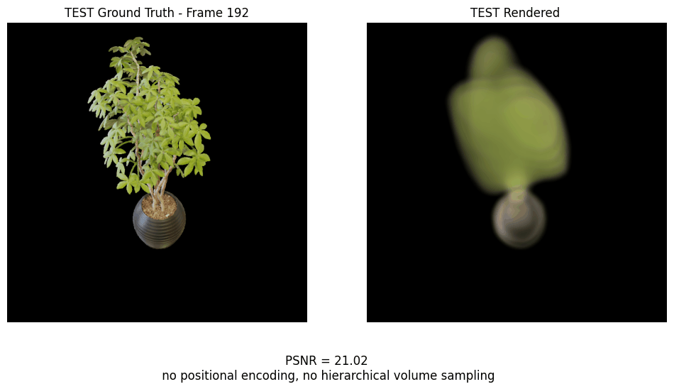
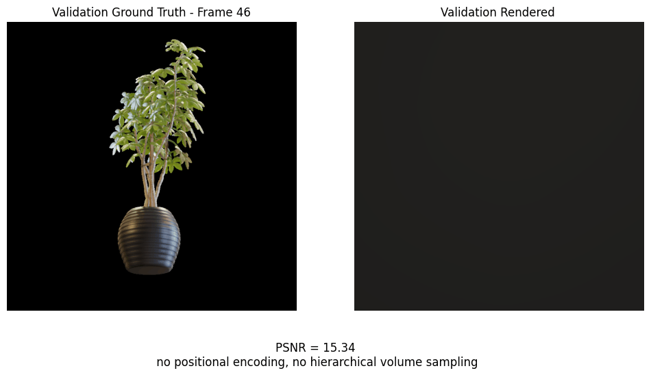
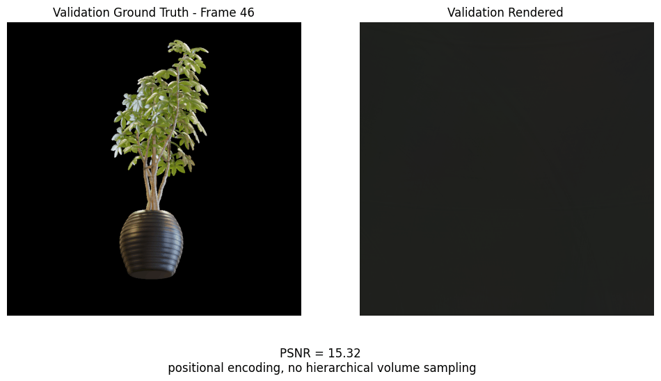
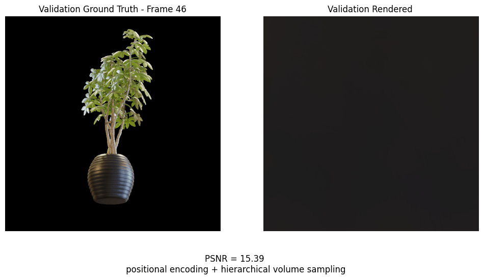

<!-- Explain here what's going on with this project -->
# NeRF reimplementation

___

<!--  -->
<p align="center"></p>

___
## Motivation


I have decided that there is no better way to fully understand something than getting your hands dirty.
Therefore, I am starting a series of reimplementation of papers that make me curious.

Right now, I am also having a fixation on image-based 3D representation techniques.

So, my first focus is on a reimplementation (in PyTorch) of the original **NeRF** paper **Mildenhall et al., 2020: [NeRF: Representing Scenes as Neural Radiance Fields for View Synthesis](https://arxiv.org/abs/2003.08934)**.

This is more about implementing something from a paper and **gaining insight into the thought process behind it**, rather than anything else. Faithful reimplementations from the original TensorFlow version, to PyTorch, have existed for long now.

___
## Outline

The implementation follows my understanding of the written paper. It also goes from a "minimal" (although view dependance is added from the start) version of NeRF to ones where positional encoding and hierarchical sampling are gradually added. ~~First drafts~~ A restructured version of this exploratory process can be found in [this notebook](./NeRF_exploration.ipynb) along with my reasoning. (There is also a version with cleared outputs : [here](./NeRF_exploration_cleared.ipynb) )
___
## Scope
 I strictly **limited it to the synthetic blender dataset** from the original project. This is also fundamentally a learning project, I didn't train through the 100k iterations mentionned on the paper (2000 iterations only showcased here), nor did I always use the recommanded amount of samples along the rays, as I worked with my domestic RTX 3050 GPU, and mostly wanted quick previews. <!--There are several copies of the same block with small variations, the two earliest versions sometimes have missing elements compared to the description in the article (such as the networks architecture), as I am trying to imagine what was present at what point during their development. --> I will eventually look into Colab to go a bit further.

___
## "Difficulties encountered"

The goal was to implement it from reading the paper only. Although there were some instances where I had to go look inside the original project to get unstuck on:
- What represents the transformations associated with the blender images 
- How to finalize inverse transform sampling to retrieve fine samples.

I haven't peeked inside the original project other than that, as the point is also to recognize how much the article goes into details in their description, once I compare what I got to their original repository. 

Another goal of this project was to serve as an introduction to PyTorch and Cuda. So there is probably some optimizations missing, or lack of safeguarding that I don't instinctively perceive yet. I definitely don't master the ML component of the project yet and lack intuiton / correct analysis.

___
## Installation and execution

### **The notebook is provided with precomputed results for a quick lookup**. 
However, if you wish to run it:

<!-- - download the **NeRF_exploration.ipynb** notebook and the **requirements.txt** file, and : -->

## Setup

<!-- Using the Makefile
```bash
make setup-venv
``` -->

Manually :

```bash
# Create virtual environment
python -m venv .venv_nerf
#Activate it :
# Windows:
.venv_nerf\Scripts\activate
# macOS / Linux:
source .venv_nerf/bin/activate
# Upgrade pip
pip install --upgrade pip

# Install PyTorch with CUDA support if possible
pip install torch --index-url # with Cuda version corresponding to your GPU : https://pytorch.org/get-started/locally/
# Install dependencies
pip install -r requirements.txt
```

## Dataset and project structure

As mentioned before, this project only uses the synthetic blender dataset from the original project. It also focuses on only one scene.
The [original paper repository](https://github.com/bmild/nerf?tab=readme-ov-file#project-page--video--paper--data) gives out the link to their datasets [here](https://drive.google.com/drive/folders/1cK3UDIJqKAAm7zyrxRYVFJ0BRMgrwhh4)
Take any one of the scene in the **nerf_synthetic** folder and make sure you put the following in a **data** folder at the same level as the notebook:
Otherwise, the paths to the data folders are defined at the very beginning of the notebook in case you would need to update them. 
```text

data/
├── train/
├── val/
├── test/
├── transforms_train.json
├── transforms_val.json
└── transforms_test.json
notebook.ipynb
requirements.txt
```
___
### Visual overview of the notebook content:

Minimal : no positional encoding, no hierarchical volume sampling:
<!--  -->
<p align="center"></p>
Intermediate : Positional encoding, no hierarchical volume sampling:
<!--  -->
<p align="center"></p>
"Complete" : Positional encoding, Hierarchical volume sampling:
<!--  -->
<p align="center"></p>

___